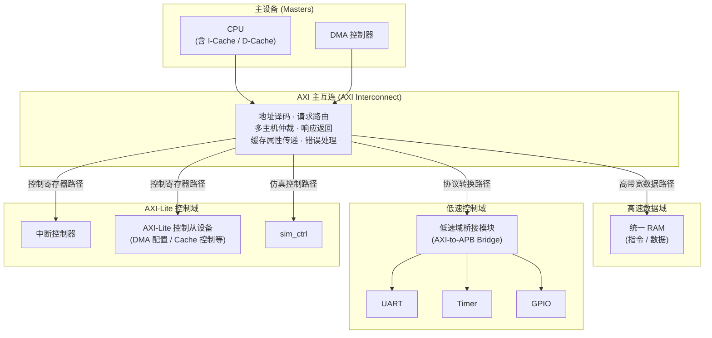

> 太元当前版本 SoC 的系统需求基线文档。本文档只定义当前版本系统必须具备的组成、能力、接口与验收要求，不展开模块级实现细节，不讨论未来版本路线。

 ### 相关资源
 [SoC 系统技术规范说明](../02_specifications/soc_specification.md)
 
 
## 1. 文档范围与系统目标

本文档定义当前版本 SoC 的系统需求，约束系统边界、总体架构、关键模块职责、软件可见接口以及验收标准。本文档面向系统层，关注“系统必须包含什么、系统必须支持什么、系统达到什么状态才算完成”，不展开 CPU 微结构、总线信号时序、寄存器位域、状态机实现等技术细节。相关内容应在后续的《SoC 总体技术规范》及各模块子规范中进一步展开。

当前版本 SoC 的目标不是重复验证 CPU 本体，而是在既有处理器基础之上，构建一个包含 Cache、AXI 主互连、DMA、统一主存、MMIO 外设、中断控制器与仿真控制模块的完整系统。该系统需要能够支撑总线功能验证、多主机访问验证、DMA 数据搬运验证以及软件可编程控制验证。系统必须在统一顶层下稳定运行，并具备可执行、可判断结果的仿真验收能力。

当前系统正式纳入的模块包括 CPU、I-Cache、D-Cache、统一 RAM、AXI 主互连、DMA、UART、Timer、GPIO、中断控制器、AXI-Lite 控制从设备、低速域桥接模块以及 sim_ctrl。上述模块共同构成当前版本 SoC 的正式系统范围。
### 当前版本 SoC 正式系统范围

| 模块类别       | 模块名称           | 说明                                 |
| ---------- | -------------- | ---------------------------------- |
| **处理器与缓存** | CPU            | 通用处理核，负责系统软件运行与设备控制                |
|            | I-Cache        | 指令缓存，面向指令访问路径                      |
|            | D-Cache        | 数据缓存，面向数据访问路径                      |
| **主设备**    | DMA            | 第二主设备，承担数据搬运与多主机验证职责               |
| **存储**     | 统一 RAM         | 主存资源，指令与数据共用，支持 CPU 与 DMA 并发访问     |
| **互连与桥接**  | AXI 主互连        | 负责地址译码、请求路由、多主机仲裁、响应返回等系统职责        |
|            | 低速域桥接模块        | 将低速寄存器型外设接入低速控制域                   |
| **外设**     | UART           | 基础串行外设，支持配置、状态读取与数据收发              |
|            | Timer          | 基础定时外设，支持定时功能与中断产生                 |
|            | GPIO           | 寄存器型外设，支持基本输入输出与中断能力               |
| **系统控制**   | 中断控制器          | 汇聚外设中断源，向 CPU 输出中断请求，提供管理寄存器       |
|            | AXI-Lite 控制从设备 | 暴露控制类寄存器接口，供软件访问配置寄存器              |
|            | sim_ctrl       | 仿真控制模块，提供仿真结束触发、调试输出与 PASS/FAIL 判定 |

---

## 2. 系统总体架构

当前版本 SoC 采用以 AXI 为核心的分层互连结构。CPU 通过 Cache 子系统接入主互连，其中 D-Cache 作为数据访问路径的一部分，I-Cache 作为指令访问路径的一部分；DMA 作为第二个主设备直接接入 AXI 主互连。AXI 主互连负责连接主设备与各类从设备，并承担地址译码、请求路由、多主机仲裁、响应返回、错误访问处理以及不同类型从设备区分等系统职责。

从系统组织上看，主存资源直接挂接在 AXI 主互连下，作为高带宽存储从设备参与系统访问；低速寄存器型外设通过桥接方式进入低速控制域；控制类寄存器接口通过 AXI-Lite 风格的接口暴露给软件使用。系统在架构上明确区分高速数据访问路径与低速控制访问路径。前者主要服务于 CPU、DMA 与主存之间的数据传输，后者主要服务于 UART、Timer、GPIO、中断控制器、DMA 配置寄存器、Cache 控制寄存器以及其他控制类模块的寄存器访问。
当前版本 SoC 的主从设备关系如下表所示：

| 设备类型 | 模块 |
|---|---|
| Master | CPU、DMA |
| Slave | RAM、低速域桥、AXI-Lite 控制从设备、各类 MMIO 外设及其控制接口 |

在上述结构中，RAM 单独挂接在 AXI 主互连上，以保证主存访问路径的直接性与带宽优先级；低速外设不直接参与高带宽数据路径，而通过桥接方式接入低速控制域；DMA、Cache 以及其他控制类模块的寄存器接口通过控制通道对外暴露。该组织方式构成当前版本 SoC 的正式顶层架构。

### 当前版本 SoC 系统总体架构图

---
## 3. 处理器与存储子系统需求

CPU 在当前 SoC 中作为通用处理核使用。它必须能够承担系统软件运行、主存访问、MMIO 外设访问、DMA 配置、中断响应以及异常处理等系统级职责。本文档不对 CPU 的 ISA 范围、微结构优化、性能提升路线提出要求，只要求其能够支撑当前 SoC 的系统运行、总线控制、外设控制与软件执行。当前 CPU 为本版本既定处理器。

当前系统包含 I-Cache 与 D-Cache，二者都属于 CPU 正常运行路径的一部分，不是附属模块。I-Cache 面向指令访问路径，D-Cache 面向数据访问路径。D-Cache 必须位于 CPU 与主存 / 总线之间，并对 RAM 路径生效；MMIO 访问不得进入 D-Cache。系统在进行 MMIO 访问时，应能够通过访问属性将主存型访问与寄存器型访问区分开，使 Cache 与总线对不同类型访问采取正确处理方式。I-Cache 当前不要求提供 flush / invalidate 控制；D-Cache 必须支持软件使能、关闭以及 flush / invalidate 类控制能力。

当前系统采用统一 RAM 作为主存资源。物理上，指令与数据均来自同一片 RAM；逻辑上，系统必须区分取指访问与数据访问。CPU 必须能够访问该主存，DMA 也必须能够访问该主存，并且系统必须支持 CPU 与 DMA 对同一主存系统的并发访问。由于 D-Cache 与 DMA 同时参与对 RAM 的访问，当 CPU 与 DMA 访问同一 RAM 区域时，系统必须处理 Cache 一致性问题。该问题属于当前版本正式需求，不得回避，也不得简单推迟到后续版本。

---

## 4. 地址空间与软件可见接口需求

当前版本 SoC 在系统需求层不写具体地址映射表，也不写各模块 base address，但必须明确地址空间划分原则。系统至少需要区分主存空间、MMIO 控制空间以及控制 / 状态空间；当 DMA、外设数据寄存器或 FIFO 等模块对地址属性有特殊要求时，系统还应能够支持必要的数据缓冲或外设数据访问空间划分。该划分用于区分不同访问对象的系统语义与访问属性，而不是仅作为实现阶段的地址分配细节。

RAM 与 MMIO 必须在地址属性上明确区分。主存访问与寄存器型外设访问在 Cacheable、Bufferable 以及 Device 类语义上不能混淆，系统必须能够对两类访问进行正确表达与处理。对于主存路径，系统应支持与 Cache 相关的必要属性传递；对于 MMIO 路径，系统应保证访问不被错误缓存、不被当作普通主存访问处理。

从软件视角看，当前系统必须显式暴露以下接口：地址空间划分、外设寄存器接口、DMA 配置接口、中断控制器接口、Cache 控制寄存器以及仿真控制寄存器。所有外设均通过 MMIO 方式挂载于系统总线，CPU 通过标准 load/store 指令访问外设寄存器，不提供专用 I/O 指令，也不提供独立于主地址空间之外的专用外设地址空间。软件通过读写外设的控制寄存器、状态寄存器与数据寄存器完成配置、命令下发与状态查询。各外设具体的寄存器地址、位域定义与访问权限不在本文档中展开，而在后续独立的寄存器手册中说明。

此外，软件必须能够通过 MMIO 完成对 UART、Timer、GPIO、DMA、中断控制器和 Cache 控制寄存器的配置与状态读取。DMA 软件接口必须支持寄存器配置模式与描述符模式，软件应能够配置源地址、目的地址、传输长度以及下一个描述符地址，并能够完成启动、停止、状态读取与完成中断处理。中断控制器必须向软件提供中断状态读取、中断屏蔽与使能、中断来源识别以及中断清除能力。D-Cache 必须向软件提供使能、关闭、flush 与 invalidate 等控制能力；I-Cache 当前不要求提供对应控制接口。

仿真控制寄存器也是软件可见接口的一部分。软件必须能够通过该接口触发仿真结束、输出字符或数值信息，并给出测试 PASS / FAIL 的判定结果。

---

## 5. 外设与系统控制需求

UART 是当前版本正式系统外设之一。CPU 必须能够通过 MMIO 访问 UART，完成基础配置、状态读取与数据收发控制。UART 需要支持基本输出与调试输出功能。需要说明的是，系统中的 sim_uart 属于仿真辅助机制，与正式 UART 外设在角色上不同，二者不能混同。

Timer 是当前版本的基础定时外设。它必须支持基本定时功能，并能够产生中断。Timer 在系统中既服务于时间相关控制，也服务于中断路径验证。

GPIO 是当前版本的正式寄存器型外设。它必须支持基本输入输出功能，并支持中断能力。GPIO 的存在不仅用于基础外设访问验证，也用于中断控制路径验证。

中断控制器是当前版本 SoC 的正式系统模块。它必须能够汇聚来自 Timer、GPIO、UART、DMA 等模块的中断源，并向 CPU 输出中断请求。中断控制器必须提供中断状态、屏蔽、类型 / 优先级管理寄存器，使 CPU 可以通过读写中断控制器判断中断来源并控制中断行为。后续系统中若中断与 DMA 自动触发逻辑结合，也必须通过该模块进行统一管理。

DMA 是当前版本系统中的正式主设备。它不仅承担数据搬运功能，也承担多主机 AXI 场景验证职责。DMA 必须同时支持寄存器配置模式与描述符模式；软件应能够配置源地址、目标地址、传输长度及下一描述符地址，并完成搬运流程控制。当前 DMA 必须支持三类基本搬运：mem2mem、外设到内存、内存到外设。DMA 必须支持完成中断，并且该中断行为应可配置。DMA 的访问范围不仅包括主存，还应包括外设数据寄存器、FIFO 等数据接口。由于 DMA 与 CPU 共享主存系统并共同参与对 RAM 的访问，DMA 与 Cache 的一致性问题必须作为当前版本系统需求处理并解决。

sim_ctrl 属于当前版本系统正式组成的一部分，但其角色主要服务于开发与仿真。该模块必须提供仿真结束触发、调试字符 / 数值输出以及 PASS / FAIL 判定接口。在综合实现中，该模块可以被移除或映射为空操作，但在当前版本系统需求中，它属于正式系统控制基础设施的一部分。

---

## 6. 总线与互连需求

当前系统采用 AXI 为主互连，并采用高低速域分层结构。CPU 与 DMA 作为 AXI 主设备接入互连；RAM 直接作为 AXI 从设备挂接，以保证主存访问带宽与路径直接性；低速寄存器型外设通过 APB Bridge 等桥接方式接入低速控制域；DMA、Cache、PCIe 等控制寄存器通过 AXI-Lite 风格的接口对软件暴露。当前系统可以单独写入 AXI-Lite 这一控制接口层，但系统核心互连仍以 AXI 主互连为中心。

互连必须承担以下系统职责：完成地址译码，根据地址空间与访问属性进行请求路由，在 CPU 与 DMA 两个主设备并发工作时完成多主机仲裁，将读写响应正确返回给对应主设备，对非法访问或错误访问进行处理，并区分不同类型从设备。互连还必须明确区分高速数据访问与低速控制访问，前者面向主存与 DMA 数据搬运路径，后者面向寄存器型控制访问路径。

当前版本总线 / 互连的 AXI 功能需求如下表所示，表中所有项目均属于当前正式需求，不区分“当前必须”和“后续实现”：

| 功能项 | 当前需求 |
|---|---|
| 单拍读写 | 必须支持 |
| INCR burst | 必须支持 |
| burst length 支持 | 必须支持 |
| WSTRB 有效 | 必须支持 |
| WLAST / RLAST 正确 | 必须支持 |
| 多 outstanding | 必须支持 |
| out-of-order 完成 | 必须支持 |
| 不同 ID 事务 | 必须支持 |
| 非对齐访问 | 必须支持 |
| 错误响应 | 必须支持 |

在访问对象处理上，RAM 作为高带宽从设备直接挂载于 AXI 上；MMIO 设备可以挂载在低速总线上。两类访问在访问属性上必须区分。互连需要支持必要的 Cache / Buffer 属性传递，但互连自身不承担内部缓存功能。系统还必须支持 CPU 与 DMA 并发访问同一主存系统，这是当前版本总线需求的重要组成部分。

---

## 7. 时钟、复位与基础控制需求

当前系统为单时钟系统。CPU、Cache、AXI 互连与 RAM 当前位于同一主时钟域。低速域在逻辑上进行区分，但当前实现阶段可以与主时钟同域工作。

系统提供全局复位源 `sys_rst_n`，并通过两级同步器后向各模块分发。除全局复位外，系统还应在 AXI4-Lite 系统控制器中预留软件复位控制寄存器，使 CPU 可以通过软件方式对 DMA、PCIe 控制器等关键模块实施独立复位。这一要求属于基础控制需求的一部分。

CPU 核心采用同步复位。顶层复位同步器必须保证复位释放与时钟上升沿的时序关系满足要求。对于 AXI 总线接口，复位释放后所有通道的 VALID 信号必须保持低电平；总线接口必须在协议允许的时钟周期内进入空闲状态，并能够在之后正常响应或发起传输。

系统中的仿真与调试基础设施也属于基础控制需求的一部分。仿真控制寄存器位于预定义的仿真地址位置，支持仿真结束触发、调试字符 / 数值输出以及测试结果判定（PASS / FAIL）。在综合流程中，该寄存器可以被移除或映射为空操作。

所有低速外设在复位后都必须进入可预测的默认状态。为避免误驱动，GPIO 复位后应默认为输入模式；UART 复位后发送器应被禁止，波特率发生器停止；Timer 复位后计数器停止，中断禁止。各外设寄存器的复位值需在后续寄存器手册中明确标注。如下表所示：

| 外设 | 复位后默认状态 |
|---|---|
| GPIO | 输入模式 |
| UART | 发送器禁止，波特率发生器停止 |
| Timer | 计数器停止，中断禁止 |

---

## 8. 验收需求

当前版本系统验收不再重复 CPU 本体功能验证，也不再以 CPU 独立验证为主要目标。系统验收的重点是主存访问、MMIO 外设、Cache、DMA、中断控制与总线 / 互连功能在统一 SoC 中的正确运行。

功能验收范围至少应覆盖 RAM 访问、MMIO 外设访问、UART、Timer、GPIO、中断控制器、Cache、DMA 与总线 / 互连。总线 / 互连验收必须逐项覆盖单拍读写、burst 访问、WSTRB、WLAST / RLAST、多主机并发、多 outstanding、out-of-order、非对齐访问与错误响应等功能项。DMA 验收必须覆盖寄存器模式、描述符模式、mem2mem、外设到内存、内存到外设、完成中断以及与 CPU 并发访问主存等场景。Cache 验收必须覆盖 I-Cache 取指正常、D-Cache 读写行为正确、D-Cache flush / invalidate 有效以及 CPU / DMA 共享 RAM 区域时一致性处理正确等内容。

当前版本系统验收采用尽量快速、简洁但有效的方式进行，不要求一次做到完备验证，但必须具备明确的基本验证闭环。仿真验收方式必须包括系统级 smoke test、PASS / FAIL 自动判定、最小回归集合以及关键功能独立测试。也就是说，系统不仅要能运行，还必须能用尽量自动化的方式判定是否满足需求。

---

## 9. 结论

本文档定义了当前版本 SoC 的正式系统需求边界。当前系统并不是一个只用于演示的最小样机，而是一个包含 CPU、Cache、统一主存、AXI 主互连、DMA、MMIO 外设、中断控制器以及仿真控制基础设施的完整 SoC。本文档在系统层明确了模块组成、顶层架构、主从关系、存储组织、地址空间原则、软件可见接口、外设功能、总线能力、时钟复位要求以及验收基线。

后续《SoC 总体技术规范》将在本文档基础上，进一步展开系统组织方式、模块接口关系、地址映射、具体时钟复位组织以及实现约束；各子规范将在此基础上展开 Interconnect、DMA、UART、Timer、GPIO、寄存器手册等具体内容。本文档本身作为当前版本 SoC 的系统需求基线，应作为后续技术展开与功能验收的直接依据。
