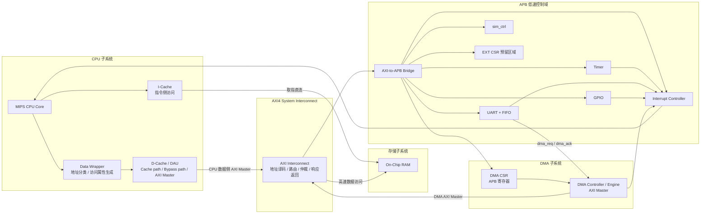
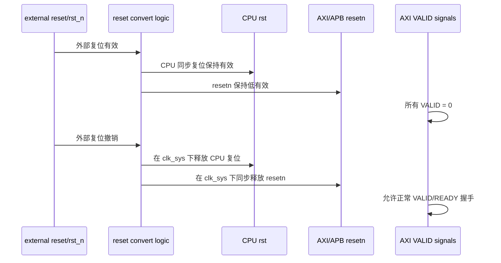
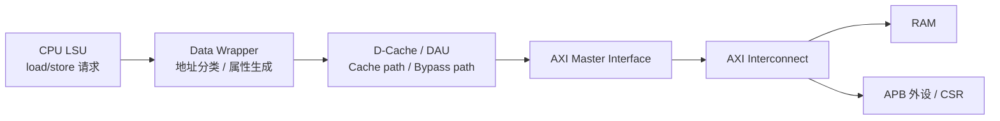
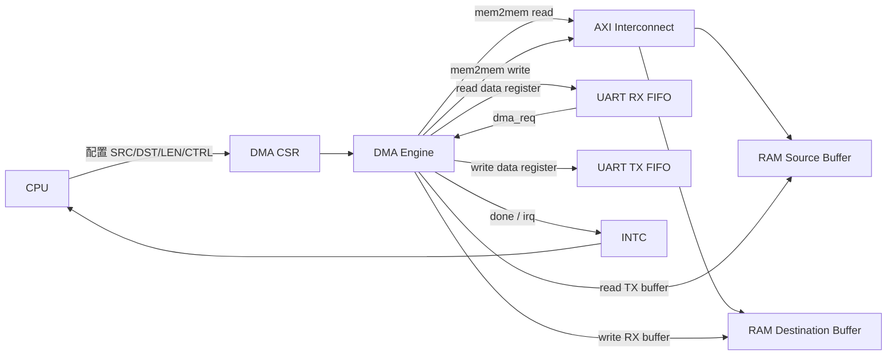
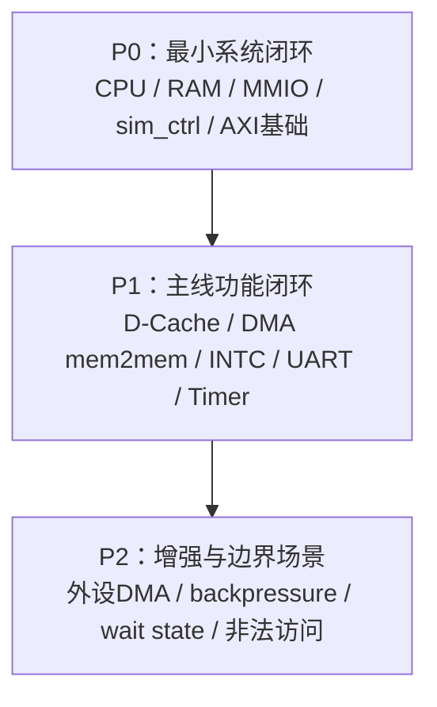

  
# SoC系统技术规范说明  
  
本文档由 [SoC 系统需求说明](../01_requirements/soc_requirement.md) 派生，用于规定当前 SoC 系统在 RTL 设计、模块集成、总线互连、地址空间、时钟复位、Cache/DMA 一致性、仿真调试和系统验收方面的技术约束。  
  
本文档是系统级技术规范，不是需求文档，也不是单个模块的 RTL 设计说明。它负责定义 SoC 的系统边界、模块职责、接口原则和当前版本实现范围；具体模块内部结构、寄存器位域、状态机和详细验证方法，应放入后续模块设计文档中。  
  
---  
  
## **1. 文档范围与设计基线**  
  
### **1.1 文档定位**  
  
本文档用于连接系统需求和 RTL 实现，主要回答以下问题：  
  
| 问题                 | 本文档负责回答的内容                                       |
| :----------------- | :----------------------------------------------- |
| 当前 SoC 是什么结构       | CPU、Cache、AXI、DMA、RAM、APB 外设和中断的系统组织方式           |
| 当前 SoC 包含哪些模块      | 模块组成、主从关系、接口类型和职责边界                              |
| 地址空间如何划分           | RAM、MMIO、外设、扩展区域的地址原则与访问属性                       |
| 总线能力支持到什么程度        | AXI4 / APB 的当前支持范围和限制                            |
| CPU、Cache、DMA 如何协同 | CPU 数据访问链路、MMIO bypass、write-through 和 DMA 一致性原则 |
| 怎么验证系统正确           | sim_ctrl、PASS/FAIL、回归测试和 P0/P1/P2 验收标准           |
| 当前版本做到哪里算完成        | V0.1 / V0.2 / V1.0 阶段划分与完成标准                     |


本文档不展开以下内容：  
  
| 不在本文档展开的内容                                       | 应放置位置                        |
| :----------------------------------------------- | :--------------------------- |
| D-Cache tag/data array、替换策略、linefill 状态机         | `D-Cache / DAU 设计规范.md`      |
| CPU 数据侧 AXI Master 端口和状态机                        | `CPU 数据侧 AXI Master 接口规范.md` |
| AXI Interconnect 仲裁器、response mux、通道 buffer      | `AXI Interconnect 设计规范.md`   |
| AXI-to-APB Bridge 的具体转换状态机                       | `AXI-to-APB Bridge 设计规范.md`  |
| DMA CSR 位域、burst 拆分、外设 request 细节                | `DMA 设计规范.md`                |
| UART / Timer / GPIO / INTC / sim_ctrl 寄存器 offset | 对应模块设计规范                     |
| 具体 testbench 代码和回归脚本                             | `SoC 验证计划.md`                |

#### 本系统为32位系统
  则
  
|中文名|英文名|典型长度（bit）|典型长度（Byte）|备注|
|---|---|---|---|---|
|位|bit|1|1/8|最小单位|
|字节|Byte|8|1|内存编址基本单位|
|**字（word）**|word|**32**|**4**|**CPU 一次处理的数据宽度**|
|半字|half word|16|2|字的一半|
|双字|double word|64|8|字的两倍|
|存储字|storage word|通常 = 字长 = 32|4|一次内存读/写的数据块大小|

---  
  
### **1.2 设计基线**  
  
当前 SoC 以已有 MIPS CPU 为控制核心，面向 AXI 化 SoC 工程闭环进行设计。系统不以完整商用 SoC 为目标，也不继续深挖 CPU 微结构优化，而是优先完成 CPU、Cache、AXI Interconnect、RAM、DMA、APB 外设、中断和仿真调试之间的系统集成。  
  
当前系统默认处于以下设计环境：  
  
| 项目          | 当前设计基线                            |
| :---------- | :-------------------------------- |
| CPU         | 单核 MIPS CPU，作为稳定控制核使用             |
| 软件环境        | 裸机程序，无操作系统                        |
| 地址空间        | 统一 32-bit 物理地址空间                  |
| 存储资源        | On-Chip RAM，容量参数化                 |
| 系统总线        | AXI4                              |
| 低速控制域       | APB，经 AXI-to-APB Bridge 接入        |
| DMA         | 独立 AXI Master，当前主线为 mem2mem       |
| Cache       | I-Cache 取指，D-Cache / DAU 处理数据访问   |
| D-Cache 写策略 | write-through                     |
| 时钟域         | 当前版本单时钟域 `clk_sys`                |
| 复位          | CPU 同步复位，AXI/APB 低有效 resetn 同步释放  |
| 仿真控制        | sim_ctrl 作为 APB 外设，由 testbench 监控 |
  
---  
  
### **1.3 当前设计目标**  
  
当前版本应满足以下目标：  
  
| 目标  | 说明                                           |
| :-- | :------------------------------------------- |
| 可运行 | CPU 能从 RAM 取指并运行裸机程序                         |
| 可访问 | CPU 能访问 RAM、MMIO 外设、DMA CSR 和 INTC           |
| 可缓存 | RAM 访问可进入 D-Cache，MMIO 访问必须 bypass Cache     |
| 可搬运 | DMA 能完成 RAM 到 RAM 的数据搬运                      |
| 可中断 | Timer、DMA 等事件能通过 INTC 通知 CPU                 |
| 可观测 | sim_ctrl 能上报 PASS/FAIL、error code 和 debug 输出 |
| 可回归 | P0/P1/P2 测试可自动运行和汇总                          |
| 可扩展 | 为外设 DMA、更多 AXI slave、Cache 维护机制预留结构空间        |
  
---  
  
## **2. 系统总体架构**  
  
### **2.1 顶层结构**  
  
当前 SoC 采用“CPU 子系统 + AXI4 System Interconnect + On-Chip RAM + DMA 子系统 + APB 低速控制域”的总体结构。  
  

  
该架构包含三个关键设计点：  
  
1. **CPU 取指路径与数据访问路径分离。** 取指路径为 `CPU -> I-Cache -> RAM`，当前版本不经过 AXI Interconnect；数据访问路径为 `CPU -> Data Wrapper -> D-Cache / DAU -> AXI Interconnect -> 目标从设备`。  
2. **DMA 是独立 AXI Master。** DMA 不依赖 CPU 代发访问，而是自行通过 AXI Interconnect 访问 RAM 或外设 data register。  
3. **高速数据域与低速控制域分离。** RAM 直接挂在 AXI 高速数据域，UART、Timer、GPIO、DMA CSR、INTC、sim_ctrl 等控制寄存器通过 AXI-to-APB Bridge 访问。  
  
---  
  
### **2.2 高速数据域与低速控制域**  
  
| 域     | 主要模块                                          | 访问特点                           |
| :---- | :-------------------------------------------- | :----------------------------- |
| 高速数据域 | RAM、预留高速 AXI Slave                            | 面向 CPU/DMA 数据访问，可支持 INCR burst |
| 低速控制域 | UART、Timer、GPIO、DMA CSR、INTC、sim_ctrl、EXT_CSR | 面向寄存器访问，当前版本只支持单拍访问            |
  
高速数据域承载普通内存访问和 DMA 数据搬运；低速控制域承载配置、状态、中断、仿真控制等寄存器访问。低速外设不直接挂接到 CPU 内部接口，也不绕过 AXI/APB 总线结构。  
  
---  
  
### **2.3 当前系统主线**  
  
当前版本的系统主线包括：  
  
```md  
CPU 运行裸机程序  
-> CPU 通过 D-Cache / DAU 访问 RAM 和 MMIO  
-> CPU 配置 DMA  
-> DMA 通过 AXI 搬运 RAM 数据  
-> DMA 完成后产生中断  
-> CPU 处理中断并检查结果  
-> CPU 通过 sim_ctrl 上报 PASS/FAIL  
```  
  
外设触发 DMA、UART FIFO 水位线触发 DMA、RAM 到 UART TX FIFO 等功能在架构上预留，作为 P2 扩展项实现。  
  
---  
  
## **3. 模块组成与职责边界**  
  
### **3.1 模块组成总览**  
  
| 模块                      | 所属子系统   | 接口类型                   | Master / Slave | 当前版本职责                                |
| :---------------------- | :------ | :--------------------- | :------------- | :------------------------------------ |
| MIPS CPU Core           | CPU 子系统 | 内部取指 / 数据接口            | 发起方            | 执行裸机程序、访问 RAM/MMIO、处理中断               |
| I-Cache                 | CPU 子系统 | RAM 直连端口               | 取指发起方          | 负责指令侧访问，当前直连 RAM                      |
| Data Wrapper            | CPU 子系统 | CPU 数据接口 / DAU 接口      | 内部适配           | 地址分类、访问属性生成                           |
| D-Cache / DAU           | CPU 子系统 | AXI Master             | Master         | Cacheable RAM 访问、MMIO bypass、AXI 事务发起 |
| AXI Interconnect        | 系统互连    | AXI                    | 互连             | 地址译码、路由、仲裁、响应返回                       |
| On-Chip RAM             | 存储子系统   | AXI Slave / RAM Port   | Slave          | 程序、数据、DMA buffer 存储                   |
| DMA CSR                 | DMA 子系统 | APB Slave              | Slave          | CPU 配置 DMA 的寄存器入口                     |
| DMA Controller / Engine | DMA 子系统 | AXI Master             | Master         | 执行 mem2mem 和外设搬运                      |
| AXI-to-APB Bridge       | 总线桥接    | AXI Slave / APB Master | Bridge         | 将 AXI 单拍访问转换为 APB 访问                  |
| UART + FIFO             | APB 外设  | APB Slave              | Slave          | debug 输出、FIFO、DMA request 预留          |
| Timer                   | APB 外设  | APB Slave              | Slave          | 计时与中断触发                               |
| GPIO                    | APB 外设  | APB Slave              | Slave          | 基础 MMIO smoke test                    |
| Interrupt Controller    | 中断子系统   | APB Slave + IRQ        | Slave / IRQ 聚合 | 多源 pending、mask/enable、clear          |
| sim_ctrl                | 仿真控制    | APB Slave              | Slave          | PASS/FAIL、debug 输出、error code         |
| EXT_CSR                 | 扩展控制域   | APB Slave              | Slave          | 后续控制寄存器模块预留                           |
  
---  
  
### **3.2 AXI Master 与 Slave 划分**  
  
当前版本 AXI Master 包括：  
  
| AXI Master         | 来源                      | 主要访问目标                |
| :----------------- | :---------------------- | :-------------------- |
| CPU 数据侧 AXI Master | D-Cache / DAU           | RAM、AXI-to-APB Bridge |
| DMA AXI Master     | DMA Controller / Engine | RAM、AXI-to-APB Bridge |
  
当前版本 AXI Slave 包括：  
  
| AXI Slave         | 说明                |
| :---------------- | :---------------- |
| On-Chip RAM       | 高速数据访问目标          |
| AXI-to-APB Bridge | 低速控制域入口           |
| 预留 AXI Slave Slot | 后续高速外设、调试模块或加速器预留 |
  
---  
  
### **3.3 CPU 子系统职责边界**  
  
CPU Core 不直接理解 AXI 协议。CPU 数据访问链路内部职责如下：  
  
| 模块            | 职责                                                              |
| :------------ | :-------------------------------------------------------------- |
| CPU Core      | 发起取指、load/store、MMIO 访问和中断响应                                    |
| Data Wrapper  | 根据地址判断 RAM/MMIO，生成 `cacheable / uncached / device / ordered` 属性 |
| D-Cache / DAU | 根据访问属性选择 Cache path 或 bypass path，并发起 AXI 事务                    |
  
Data Wrapper 负责判断“这是什么访问”；D-Cache / DAU 负责判断“这个访问怎么执行”；AXI Master 接口负责把访问转换为 AXI 事务。  
  
---  
  
### **3.4 DMA 子系统职责边界**  
  
DMA 子系统分为配置面和执行面：  
  
| 部分         | 说明                                                     |
| :--------- | :----------------------------------------------------- |
| DMA CSR    | APB 寄存器，由 CPU 配置 SRC_ADDR、DST_ADDR、LEN、CTRL、STATUS 等字段 |
| DMA Engine | 独立 AXI Master，执行实际数据搬运                                 |
  
当前版本 DMA 必须支持 mem2mem、INCR burst、done 状态和完成中断。外设触发 DMA 作为 P2 扩展项，保留 `dma_req / dma_ack` 接口方向。  
  
---  
  
## **4. 地址空间与访问属性**  
  
### **4.1 地址空间总览**  
  
当前 SoC 统一采用 32-bit 物理地址空间。  
  
| 地址区域  | 起始地址          | 大小     | 类型            | 说明                                   |
| :---- | :------------ | :----- | :------------ | :----------------------------------- |
| RAM   | `0x0000_0000` | 参数化    | Normal Memory | 程序、数据、栈、DMA buffer                   |
| MMIO  | `0x1F00_0000` | `16MB` | Device / MMIO | APB 外设、DMA CSR、INTC、sim_ctrl、EXT_CSR |
| 未映射区域 | 其他地址          | -      | Invalid       | 当前版本仿真触发 sim fail                    |
  
```md  
RESET_VECTOR = 0x0000_0000  
RAM_BASE = 0x0000_0000  
RAM_SIZE = parameterized  
MMIO_BASE = 0x1F00_0000  
MMIO_SIZE = 16MB  
MMIO_END = 0x1FFF_FFFF  
```  
  
CPU 复位后从 `RESET_VECTOR = 0x0000_0000` 开始取指。I-Cache 取指地址与系统 RAM 地址空间一致。  
  
---  
  
### **4.2 RAM 访问属性**  
  
普通 RAM 默认访问属性如下：  
  
| 属性          |  值  |
| :---------- | :-: |
| `cacheable` |  1  |
| `uncached`  |  0  |
| `device`    |  0  |
| `ordered`   |  0  |
  
RAM 当前承担以下用途：  
  
| 用途         | 说明                       |
| :--------- | :----------------------- |
| 程序指令       | CPU 从 `0x0000_0000` 取指运行 |
| 普通数据       | CPU load/store 访问的数据     |
| 栈 / 全局变量   | 由裸机链接脚本组织                |
| DMA buffer | DMA 源缓冲区和目的缓冲区           |
  
当前版本不单独划分 DMA uncached buffer。DMA buffer 位于普通 RAM 中，依靠 D-Cache write-through 和软件访问顺序约束简化一致性问题。  
  
---  
  
### **4.3 MMIO 访问属性**  
  
MMIO 区域用于映射 UART、Timer、GPIO、DMA CSR、INTC、sim_ctrl 和扩展 CSR。当前版本只规定 MMIO 总区域和 4KB 对齐原则，各外设具体 base 地址和寄存器 offset 后续在模块文档中定义。  
  
MMIO 访问属性如下：  
  
| 属性          |  值  |
| :---------- | :-: |
| `cacheable` |  0  |
| `uncached`  |  1  |
| `device`    |  1  |
| `ordered`   |  1  |
  
MMIO 访问必须满足：  
  
```md  
- 不进入 D-Cache  
- 不 linefill  
- 不预取  
- 不写合并  
- 不乱序完成  
- 必须等待明确响应  
```  
  
---  
  
### **4.4 外设地址分配原则**  
  
当前版本只规定外设地址分配原则：  
  
| 项目         | 规则                               |
| :--------- | :------------------------------- |
| 外设地址范围     | 必须位于 `0x1F00_0000 ~ 0x1FFF_FFFF` |
| 对齐方式       | 建议 4KB 对齐                        |
| 单外设窗口      | 建议最小 4KB                         |
| 寄存器 offset | 不在本文档定义，放到模块文档                   |
| EXT_CSR    | 在 MMIO 区域内预留，不指定具体 base          |
  
---  
  
### **4.5 数据宽度与非对齐访问**  
  
当前版本 AXI 数据侧统一为 32-bit，并使用 4-bit 字节使能：  
  
```md  
AXI_DATA_WIDTH = 32  
AXI_STRB_WIDTH = 4  
```  
  
CPU 内部可以支持 byte、halfword、word 访存语义，但 AXI 侧统一以 32-bit data + `WSTRB[3:0]` 表达有效字节。  
  
当前 CPU 的 `lw/sw` 指令只产生对齐访存。非对齐访存由 `lwl/lwr`、`swl/swr` 等指令语义配合 `cpu_data_be` 实现。Wrapper 和 D-Cache / DAU 只需正确传递字节使能，不负责自动拆分非对齐访问，也不负责数据拼接。  
  
对 MMIO 外设的非法字节使能或非对齐访问，当前版本仿真触发 sim fail；后续正式版本可扩展为 APB `PSLVERR` 或 AXI `SLVERR`。  
  
---  
  
## **5. 时钟与复位方案**  
  
### **5.1 时钟域划分**  
  
当前版本采用单时钟域设计，工程中现有 CPU 时钟在本文档中统一抽象为 `clk_sys`。  
  
| 时钟域       | 频率      | 来源                  | 驱动模块                                                                     |
| :-------- | :------ | :------------------ | :----------------------------------------------------------------------- |
| `clk_sys` | 参数化     | 顶层输入 / testbench 产生 | CPU、I-Cache、D-Cache、AXI、RAM、DMA、APB Bridge、UART、Timer、GPIO、INTC、sim_ctrl |
| `clk_mem` | 当前不使用   | -                   | -                                                                        |
| `clk_apb` | 当前不独立使用 | -                   | APB 与 AXI 同属 `clk_sys`                                                   |
  
当前版本不引入独立存储时钟、独立 APB 慢时钟或 CDC 结构。若后续引入多时钟域，必须增加跨时钟桥、异步 FIFO 或同步握手逻辑。  
  
---  
  
### **5.2 复位策略**  
  
顶层需要兼容高有效复位和低有效复位输入，并统一转换为内部各模块所需形式。  
  
当前复位策略如下：  
  
| 对象        | 复位策略                         |
| :-------- | :--------------------------- |
| CPU       | 同步复位                         |
| AXI / APB | 低有效 resetn，同步释放              |
| 普通 RTL    | 按模块需要使用同步复位或 resetn，但由顶层统一转换 |
| 仿真版本      | 可先简化复位同步器                    |
| 综合版本      | 需要补充完整同步释放逻辑                 |
  
AXI / APB 侧 resetn 释放必须与 `clk_sys` 同步。所有 AXI `VALID` 类信号在复位期间必须为 0。  
  
---  
  
### **5.3 复位后状态**  
  
| 模块                | 复位后状态                               |
| :---------------- | :---------------------------------- |
| CPU               | 从 `RESET_VECTOR = 0x0000_0000` 开始运行 |
| I-Cache / D-Cache | 当前版本内容全部清零                          |
| RAM               | 复位不清零，仿真中通过 `$readmemh` 加载程序镜像      |
| DMA               | idle，寄存器内容清零，busy/done/error/irq 清零 |
| APB 外设            | 控制寄存器、状态寄存器、中断状态默认清零；特殊默认值由模块文档定义   |
| INTC              | pending 清零，mask/enable 清零，中断输出无效    |
| sim_ctrl          | PASS/FAIL、error code、debug 状态清零     |
  
复位不应清除 RAM 中通过 `$readmemh` 加载的程序镜像，否则 CPU 无法在复位释放后正常取指。  
  
---  
  
### **5.4 复位同步释放关系**  
  

  
当前版本不实现时钟门控和复杂低功耗。模块内部可以使用 enable 控制状态更新，但不应直接手写门控时钟。  
  
---  
  
## **6. 总线与互连规范**  
  
### **6.1 总线体系**  
  
当前 SoC 采用两级总线结构：  
  
```md  
上层高速系统互连：AXI4  
低速控制外设域：APB  
桥接模块：AXI-to-APB Bridge  
```  
  
```mermaid  
flowchart LR  
subgraph M["AXI Masters"]  
CPU_M["CPU Data-side AXI Master"]  
DMA_M["DMA AXI Master"]  
end  
  
IC["AXI4 Interconnect"]  
  
subgraph S["AXI Slaves"]  
RAM["On-Chip RAM"]  
BRG["AXI-to-APB Bridge"]  
EXT_AXI["预留 AXI Slave Slot"]  
end  
  
subgraph P["APB Domain"]  
UART["UART"]  
TIMER["Timer"]  
GPIO["GPIO"]  
DMA_CSR["DMA CSR"]  
INTC["INTC"]  
SIM["sim_ctrl"]  
EXT_CSR["EXT_CSR"]  
end  
  
CPU_M --> IC  
DMA_M --> IC  
IC --> RAM  
IC --> BRG  
IC --> EXT_AXI  
BRG --> UART  
BRG --> TIMER  
BRG --> GPIO  
BRG --> DMA_CSR  
BRG --> INTC  
BRG --> SIM  
BRG --> EXT_CSR  
```  
  
该结构符合常见 SoC 分层方式：高性能数据路径走 AXI，低速控制寄存器走 APB。  
  
---  
  
### **6.2 AXI 参数与支持范围**  
  
| 功能项                             | 当前版本要求                          |
| :------------------------------ | :------------------------------ |
| 协议                              | AXI4                            |
| 地址宽度                            | 参数化，当前 32-bit                   |
| 数据宽度                            | 参数化，当前 32-bit                   |
| WSTRB                           | 必须支持 `WSTRB[3:0]`               |
| ID                              | 保留 ID 信号，当前固定为 0                |
| CPU outstanding                 | 单 outstanding                   |
| DMA outstanding                 | 读写各允许一个 outstanding             |
| Burst 类型                        | 只支持 INCR                        |
| CPU linefill                    | D-Cache read miss 支持 INCR burst |
| CPU 写 RAM                       | write-through，当前先单拍写            |
| DMA 搬运                          | 支持 INCR burst                   |
| MMIO/APB                        | 当前版本全部单拍                        |
| 4KB 边界                          | burst 不允许跨 4KB                  |
| Backpressure                    | 必须支持 VALID/READY 反压             |
| Register slice                  | 允许插入，但当前不强制                     |
| 乱序返回                            | 当前不支持                           |
| WRAP / FIXED burst              | 当前不支持                           |
| Exclusive / Atomic / QoS / User | 当前不使用                           |
  
AXI Master 端必须保证不产生跨 4KB 边界的 burst。若 DMA 大块传输跨越 4KB 边界，应由 DMA 内部拆分为多个不跨界 burst。  
  
---  
  
### **6.3 AXI Interconnect 职责**  
  
AXI Interconnect 至少负责：  
  
| 职责           | 说明                                         |
| :----------- | :----------------------------------------- |
| 地址译码         | 根据地址选择 RAM、AXI-to-APB Bridge 或预留 AXI Slave |
| 请求路由         | 将 AW/W/AR 请求路由到目标 slave                    |
| 响应返回         | 将 B/R 响应返回正确 master                        |
| 仲裁           | CPU 与 DMA 同时访问同一 slave 时进行仲裁               |
| 属性传递         | 传递 cache/device/prot 等访问属性                 |
| 错误处理         | 当前非法访问触发 sim fail，后续返回 DECERR/SLVERR       |
| backpressure | 支持各通道 VALID/READY 等待                       |
  
当前版本仲裁策略为固定优先级：  
  
```md  
CPU priority > DMA priority  
```  
  
CPU 是系统控制核，因此同目标访问时优先服务 CPU。DMA 吞吐可以在第一版中让步。  
  
---  
  
### **6.4 AXI-to-APB Bridge 规则**  
  
AXI-to-APB Bridge 负责将 AXI 侧单拍访问转换为 APB 寄存器访问。  
  
| 项目          | 当前版本规则                            |
| :---------- | :-------------------------------- |
| AXI 侧访问     | 只接受单拍访问                           |
| APB 侧访问     | 单次寄存器读写                           |
| APB burst   | 不支持                               |
| PREADY      | Bridge 支持等待                       |
| 当前外设 PREADY | 默认固定为 1                           |
| PSLVERR     | 第一版 APB 不实现，非法访问仿真触发 sim fail     |
| 并发访问        | Bridge 内部串行化                      |
| DMA 访问外设    | 允许访问 data register / FIFO，当前按单拍处理 |
  
若 AXI 侧对 APB 区域发起 burst，当前版本视为非法访问并触发 sim fail。  
  
---  
  
### **6.5 错误访问原则**  
  
| 错误类型        | 当前版本处理                | 后续方向                  |
| :---------- | :-------------------- | :-------------------- |
| AXI 地址未命中   | sim fail              | DECERR                |
| Slave 内部错误  | sim fail              | SLVERR                |
| APB 非法访问    | sim fail              | PSLVERR -> AXI SLVERR |
| burst 跨 4KB | sim fail 或 Master 端拆分 | Master 端规范拆分          |
| MMIO 非法字节使能 | sim fail              | PSLVERR / SLVERR      |
| DMA 非法地址    | DMA error 或 sim fail  | DMA error 状态 + 中断     |
  
当前版本优先使用 sim fail，是为了在 bring-up 阶段快速暴露地址规划、译码和软件配置错误。  
  
---  
  
## **7. CPU 数据访问、Cache 与 DMA 一致性**  
  
### **7.1 CPU 数据访问链路**  
  
CPU 数据访问链路为：  
  
```md  
CPU LSU -> Data Wrapper -> D-Cache / DAU -> AXI Master -> AXI Interconnect  
```  
  

  
CPU 侧保留原有简洁访存接口，不直接暴露 AXI。典型信号包括 `req / addr / we / wdata / be / ready / data_ok / rdata / err`。  
  
---  
  
### **7.2 Data Wrapper 职责**  
  
Data Wrapper 接收 CPU 数据侧访问请求，根据地址空间和访问类型生成访问属性。  
  
| 地址区域       | `cacheable` | `uncached` | `device` | `ordered` | 执行方式         |
| :--------- | :---------: | :--------: | :------: | :-------: | :----------- |
| RAM        |      1      |     0      |    0     |     0     | 进入 D-Cache   |
| MMIO / CSR |      0      |     1      |    1     |     1     | bypass Cache |
| 未映射地址      |      0      |     1      |    1     |     1     | sim fail     |
  
Cache 是否参与必须在访问进入 D-Cache / DAU 前确定。MMIO、DMA CSR、INTC、sim_ctrl 等寄存器类访问不能被错误缓存。  
  
---  
  
### **7.3 D-Cache / DAU 职责**  
  
D-Cache / DAU 根据 Wrapper 给出的属性选择访问路径：  
  
| 访问类型            | 执行路径                             |
| :-------------- | :------------------------------- |
| RAM read hit    | 从 D-Cache 直接返回 CPU               |
| RAM read miss   | 通过 AXI INCR burst 进行 linefill    |
| RAM write       | 当前采用 write-through，同步写入 RAM      |
| MMIO read/write | bypass Cache，AXI 单拍访问 APB Bridge |
  
当前 D-Cache 正式采用 write-through，不启用 write-back。write-through 的核心作用是让 CPU 写入 RAM 的数据同步写回内存，从而简化 CPU 写 buffer 后 DMA 读取该 buffer 的一致性问题。  
  
---  
  
### **7.4 DMA 与 Cache 一致性原则**  
  
当前版本不实现硬件 Cache Coherency，不启用 write-back，不启用 flush / invalidate，不单独划分 DMA uncached buffer。flush / invalidate 仅作为后续扩展方向预留。  
  
| 场景                              | 当前策略                                              |
| :------------------------------ | :------------------------------------------------ |
| CPU 写 RAM，DMA 读 RAM             | 依靠 D-Cache write-through，CPU 写入同步到 RAM            |
| DMA 写 RAM，CPU 读 RAM             | 软件约束：DMA 目的 buffer 在 DMA 前不得被 CPU 缓存；测试中避免写入已缓存区域 |
| CPU 与 DMA 同时访问同一 buffer         | 当前不支持，软件必须避免                                      |
| 外设 FIFO / data register         | 属于 MMIO，CPU/DMA 访问均按 Device/uncached 处理           |
| write-back / flush / invalidate | 当前不启用，后续版本再实现                                     |
  
当前推荐的软件使用顺序为：  
  
```md  
CPU 准备 buffer  
-> CPU 配置 DMA  
-> CPU 启动 DMA  
-> DMA 执行搬运  
-> DMA done / irq  
-> CPU 确认 DMA 完成  
-> CPU 读取结果 buffer  
```  
  
DMA 传输期间，CPU 不应访问同一 buffer。  
  
---  
  
### **7.5 当前一致性限制**  
  
当前版本明确限制如下：  
  
| 限制项                       | 说明                                   |
| :------------------------ | :----------------------------------- |
| 不支持 write-back D-Cache    | 当前只支持 write-through                  |
| 不启用 flush                 | CPU 写 RAM 依靠 write-through           |
| 不启用 invalidate            | DMA 写 RAM 后，CPU 不能靠 invalidate 获取新数据 |
| 不支持硬件 snoop               | DMA 不主动维护 CPU Cache                  |
| 不支持 CPU/DMA 并发访问同一 buffer | 软件必须通过所有权切换规避                        |
| 不定义专门 memory barrier      | 当前只写软件顺序约束                           |
  
这些限制是当前版本为了控制复杂度而做出的范围约束。  
  
---  
  
## **8. 关键数据通路**  
  
### **8.1 数据通路总览**  
  
| 路径          | 起点           | 经过模块                                       | 终点           | 用途              |
| :---------- | :----------- | :----------------------------------------- | :----------- | :-------------- |
| CPU 取指      | CPU          | I-Cache                                    | RAM          | 读取程序指令          |
| CPU 读写 RAM  | CPU          | Wrapper -> D-Cache / DAU -> AXI            | RAM          | 普通数据访问          |
| CPU MMIO    | CPU          | Wrapper -> DAU bypass -> AXI -> APB Bridge | APB 外设 / CSR | 外设寄存器访问         |
| DMA mem2mem | DMA          | AXI Interconnect                           | RAM -> RAM   | 内存数据搬运          |
| 外设到内存 DMA   | UART RX FIFO | DMA -> AXI                                 | RAM buffer   | 接收数据搬运          |
| 内存到外设 DMA   | RAM buffer   | DMA -> AXI -> APB Bridge                   | UART TX FIFO | 发送数据搬运          |
| 中断          | 外设 / DMA     | INTC                                       | CPU          | 事件通知            |
| sim_ctrl    | CPU          | MMIO 路径                                    | testbench    | PASS/FAIL 与调试输出 |
  
---  
  
### **8.2 CPU 取指通路**  
  
```md  
CPU -> I-Cache -> RAM  
```  
  
当前版本 I-Cache 直连 RAM，不经过 AXI Interconnect。该路径用于 CPU 从 `RESET_VECTOR = 0x0000_0000` 开始读取指令。虽然取指路径不走 AXI，但地址语义仍属于统一 RAM 地址空间。   
  
---  
  
### **8.3 CPU 读写 RAM 通路**  
  
```md  
CPU -> Data Wrapper -> D-Cache / DAU -> AXI Interconnect -> RAM  
```  
  
CPU 读 RAM 时，D-Cache hit 直接返回；miss 时通过 AXI INCR burst 完成 linefill。CPU 写 RAM 时，当前 D-Cache 采用 write-through，写入通过 AXI 同步更新 RAM。  
  
RAM 写访问必须支持 `WSTRB[3:0]`，用于 byte / halfword / word 写入。  
  
---  
  
### **8.4 CPU MMIO 通路**  
  
```md  
CPU -> Data Wrapper -> D-Cache / DAU bypass -> AXI Interconnect -> AXI-to-APB Bridge -> APB 外设  
```  
  
MMIO 访问必须 bypass Cache。CPU 对 UART、Timer、GPIO、DMA CSR、INTC、sim_ctrl 的访问均属于 Device/uncached/ordered 访问。当前版本不采用 posted write，MMIO 写必须等待 APB 访问完成后才返回 CPU。  
  
---  
  
### **8.5 DMA 数据搬运通路**  
  

  
DMA mem2mem 是当前版本基础功能。外设到内存、内存到外设 DMA 作为 P2 扩展项，当前架构保留 UART FIFO 与 DMA 之间的 `dma_req / dma_ack` 方向。  
  
---  
  
### **8.6 中断与 sim_ctrl 通路**  
  
中断路径为：  
  
```md  
Timer / UART / GPIO / DMA -> Interrupt Controller -> CPU  
```  
  
外设到 INTC、INTC 到 CPU 均采用电平触发方式。pending 未清除前，中断保持有效。CPU 通过 MMIO 读取状态并清除中断。  
  
sim_ctrl 路径为：  
  
```md  
CPU -> MMIO -> sim_ctrl -> testbench  
```  
  
sim_ctrl 只保存 PASS/FAIL、error code 和 debug 状态，不直接调用 `$finish`。testbench 监控 sim_ctrl 并结束仿真。  
  
---  
  
## **9. 仿真调试与系统验收**  
  
### **9.1 sim_ctrl 机制**  
  
sim_ctrl 作为 APB 外设挂在 MMIO 区域内，CPU 通过真实 SoC 访问路径写入测试结果和调试信息。  
  
sim_ctrl 至少需要支持以下功能类型：  
  
| 功能             | 说明                           |
| :------------- | :--------------------------- |
| PASS/FAIL      | CPU 写入 magic value 表示测试通过或失败 |
| test id        | 标记当前测试编号                     |
| error code     | 标记失败原因或阶段                    |
| debug char     | 输出字符日志                       |
| debug value    | 输出 32-bit 数值                 |
| finish request | 表示测试已完成，由 testbench 监控       |
  
sim_ctrl 不直接调用 `$finish`，由 testbench 监控其状态并结束仿真。  
  
---  
  
### **9.2 仿真与回归要求**  
  
| 项目      | 要求                                        |
| :------ | :---------------------------------------- |
| timeout | 每个测试单独定义 `MAX_CYCLES`                     |
| 波形      | 默认不生成，失败或指定参数时生成                          |
| 日志      | 包含测试名、PASS/FAIL、error code、运行周期数、debug 输出 |
| 触发方式    | 测试尽量由 CPU 裸机软件触发真实 SoC 路径                 |
| 回归入口    | 支持 `sim_all` 或 `regression` 等一键入口         |
| 失败处理    | 回归失败时返回非零状态并输出失败测试                        |
  
推荐日志内容：  
  
```md  
[TEST] dma_mem2mem_basic  
[DBG ] DMA start  
[DBG ] SRC = 0x00002000  
[DBG ] DST = 0x00003000  
[PASS] test_id=0x0003 cycles=12845  
```  
  
---  
  
### **9.3 验证优先级**  
  
| 优先级 | 含义        | 运行策略     |
| :-- | :-------- | :------- |
| P0  | 最小系统闭环    | 每次必跑     |
| P1  | 当前版本主线功能  | 日常开发频繁运行 |
| P2  | 扩展功能和边界场景 | 阶段性运行    |
  
模块级测试可用于早期 bring-up 和定位问题，但最终验收应以系统级测试为主。  
  
---  
  
### **9.4 系统验收总表**  
  
| 模块 / 路径          | 测试项                        | 通过条件                       | 优先级 |
| :--------------- | :------------------------- | :------------------------- | :-- |
| CPU              | 复位取指运行                     | 能从 `0x0000_0000` 执行裸机程序    | P0  |
| RAM              | CPU 读写 RAM                 | 写入与读回一致                    | P0  |
| MMIO             | CPU 访问外设寄存器                | APB 外设读写正确                 | P0  |
| sim_ctrl         | PASS/FAIL 上报               | testbench 能自动判断结果          | P0  |
| AXI              | CPU -> RAM / APB           | 基础读写事务完成                   | P0  |
| D-Cache          | read hit / miss / linefill | 数据正确，linefill 正确           | P1  |
| D-Cache          | write-through              | RAM 同步更新                   | P1  |
| D-Cache          | MMIO bypass                | MMIO 不进入 Cache             | P1  |
| AXI Interconnect | CPU/DMA 路由                 | 请求到达正确 slave，响应返回正确 master | P1  |
| AXI Interconnect | CPU/DMA 仲裁                 | 同目标访问时 CPU 优先生效            | P1  |
| APB Bridge       | AXI 单拍转 APB                | APB 读写正确                   | P0  |
| DMA              | mem2mem                    | 目标 buffer 与源 buffer 一致     | P1  |
| DMA              | 多长度 / 多地址                  | 多组传输结果正确                   | P1  |
| DMA              | done / irq                 | 完成后状态和中断正确                 | P1  |
| INTC             | Timer / DMA 中断             | CPU 能读取并清除中断               | P1  |
| UART             | debug 输出                   | testbench 能打印字符/数值         | P1  |
| Timer            | 中断触发                       | 到达条件后产生中断                  | P1  |
| GPIO             | MMIO smoke test            | 基础寄存器读写正确                  | P2  |
| 外设 DMA           | UART FIFO -> RAM           | FIFO 数据搬运到 RAM             | P2  |
| Backpressure     | AXI READY 随机等待             | 事务不丢失、不死锁                  | P2  |
| APB Wait         | PREADY 插入等待                | Bridge 能正确等待完成             | P2  |
| 非法访问             | 未映射 / 非法字节使能               | 仿真触发 sim fail              | P2  |
  
---  
  
## **10. 当前版本实现范围与完成标准**  
  
### **10.1 阶段版本划分**  
  
当前 SoC 按 V0.1 / V0.2 / V1.0 推进。  
  
| 阶段   | 定位         | 目标                                             |
| :--- | :--------- | :--------------------------------------------- |
| V0.1 | 最小系统闭环     | CPU、RAM、MMIO、sim_ctrl、AXI 基础路径可用               |
| V0.2 | 主线功能闭环     | D-Cache、AXI Interconnect、DMA mem2mem、中断、基础外设可用 |
| V1.0 | 可展示 SoC 基线 | P0/P1 主线稳定，通过回归，文档完整                           |
  
---  
  
### **10.2 当前版本必须实现项**  
  
| 功能                          | 当前版本要求                                                |
| :-------------------------- | :---------------------------------------------------- |
| CPU + RAM + MMIO + sim_ctrl | 必须完成最小运行闭环                                            |
| AXI Interconnect            | 支持 CPU/DMA 到 RAM/APB Bridge 的路由、仲裁和响应返回               |
| D-Cache / DAU               | read hit、read miss、linefill、write-through、MMIO bypass |
| DMA                         | mem2mem、INCR burst、done、irq                           |
| Interrupt Controller        | 多源 pending、mask/enable、clear                          |
| UART / Timer / GPIO         | 基础寄存器访问，UART debug，Timer 中断，GPIO smoke test           |
| APB 低速域                     | 基础寄存器读写，Bridge 支持 PREADY 等待，PSLVERR 后续补               |
| 回归测试                        | P0 必跑，P1 日常跑，P2 阶段性跑                                  |
  
---  
  
### **10.3 P2 扩展项**  
  
| 功能                       | 当前定位            |
| :----------------------- | :-------------- |
| 外设触发 DMA                 | P2 扩展项，主链路稳定后实现 |
| UART RX FIFO 水位线触发 DMA   | P2 扩展项          |
| RAM -> UART TX FIFO DMA  | P2 扩展项          |
| AXI backpressure 随机测试    | P2 回归增强         |
| APB PREADY wait state 测试 | P2 回归增强         |
| 非法访问测试                   | P2 错误路径测试       |
| APB PSLVERR              | 后续正式错误响应扩展      |
  
---  
  
### **10.4 当前版本明确不做项**  
  
| 不实现项               | 原因                                    |
| :----------------- | :------------------------------------ |
| write-back D-Cache | 会引入 dirty line、writeback 和 DMA 一致性复杂度 |
| flush / invalidate | 当前仅预留方向，不启用 Cache Maintenance         |
| 硬件 Cache Coherency | 不实现 snoop、ACE、CHI 或 I/O coherency     |
| MMU / 虚拟内存         | 当前裸机 SoC 不需要                          |
| 多核系统               | 会引入一致性、中断和互连复杂度                       |
| DDR Controller     | 当前使用 On-Chip RAM 完成系统闭环               |
| 复杂低功耗 / 时钟门控       | 当前只做单时钟域、常开系统                         |
| 完整 AXI 多 ID / 乱序   | 当前 ID 固定为 0，不支持乱序返回                   |
| 描述符链表 DMA          | 当前 DMA 以寄存器配置和 mem2mem 为主             |
| 完整 UVM 验证平台        | 当前以轻量系统级仿真和回归为主                       |
  
---  
  
### **10.5 实现顺序建议**  
  

  
推荐按以下顺序推进：  
  
| 阶段  | 实现重点                                                         |
| :-- | :----------------------------------------------------------- |
| P0  | CPU 取指、RAM 访问、AXI 基础读写、APB Bridge、sim_ctrl                   |
| P1  | Data Wrapper、D-Cache、MMIO bypass、DMA mem2mem、INTC、Timer/UART |
| P2  | 外设触发 DMA、backpressure、PREADY wait state、非法访问测试               |
  
---  
  
### **10.6 当前版本完成门槛**  
  
当前版本完成需要满足：  
  
```md  
- P0 测试全部通过  
- P1 主线测试通过  
- CPU 能运行裸机程序并访问 RAM / MMIO  
- D-Cache 支持 read hit / miss / linefill / write-through / MMIO bypass  
- AXI Interconnect 支持 CPU/DMA 到 RAM/APB Bridge 的访问  
- DMA mem2mem 支持 INCR burst、done、irq  
- Timer 中断和 DMA done 中断可被 CPU 响应并清除  
- sim_ctrl 支持 PASS/FAIL、error code、debug 输出  
- regression 或 sim_all 可以自动运行并汇总结果  
```  
  
P2 功能未完成时，只要 P0/P1 主线稳定，仍可认为当前 SoC 已具备基础展示能力。  
  
---  
  
## **附录 A：待定项与后续模块文档**  
  
### **A.1 当前待定项**  
  
| 待定项                            | 当前状态                     | 后续处理位置                           |
| :----------------------------- | :----------------------- | :------------------------------- |
| `RAM_SIZE`                     | 参数化                      | 地址空间定义 / RAM 模块文档                |
| 各外设 base 地址                    | 仅规定 MMIO 区域和 4KB 对齐原则    | 地址空间更新 / 外设模块文档                  |
| 各模块寄存器 offset                  | 本文档不定义                   | 对应模块设计规范                         |
| `sim_ctrl` magic value         | 本文档只定义机制                 | `sim_ctrl 模块设计规范.md`             |
| DMA CSR 位域                     | 本文档只定义寄存器类型              | `DMA 设计规范.md`                    |
| INTC pending/mask/clear 位域     | 本文档只定义功能要求               | `Interrupt Controller 设计规范.md`   |
| UART FIFO 深度 / 水位线             | 待模块设计阶段确定                | `UART 模块设计规范.md` / `DMA 设计规范.md` |
| D-Cache line size / 组相联 / 替换策略 | 待 D-Cache 设计阶段确定         | `D-Cache / DAU 设计规范.md`          |
| AXI Interconnect 内部实现          | 系统级只规定职责和策略              | `AXI Interconnect 设计规范.md`       |
| AXI-to-APB Bridge 状态机          | 系统级只规定转换原则               | `AXI-to-APB Bridge 设计规范.md`      |
| DMA burst 拆分规则                 | 系统级规定不跨 4KB              | `DMA 设计规范.md`                    |
| 外设触发 DMA 完整流程                  | P2 扩展项                   | `DMA 设计规范.md` / `UART 模块设计规范.md` |
| 回归测试列表                         | 本文档只定义验收标准               | `SoC 验证计划.md`                    |
| 软件启动与链接脚本                      | 本文档只规定地址空间和 reset vector | `软件运行与链接说明.md`                   |
  
---  
  
### **A.2 后续模块文档清单**  
  
| 文档名称                           | 主要内容                                                           |
| :----------------------------- | :------------------------------------------------------------- |
| `CPU 数据侧 AXI Master 接口规范.md`   | CPU req/data_ok、Data Wrapper、D-Cache 到 AXI 的事务转换               |
| `D-Cache / DAU 设计规范.md`        | Cache 结构、hit/miss、linefill、write-through、MMIO bypass、Cache 参数  |
| `AXI Interconnect 设计规范.md`     | 地址译码、CPU/DMA 仲裁、读写通道、响应返回、slave slot 扩展                        |
| `AXI-to-APB Bridge 设计规范.md`    | AXI 单拍读写到 APB SETUP/ACCESS 的转换、PREADY、错误处理                     |
| `DMA 设计规范.md`                  | DMA CSR、mem2mem、INCR burst、done/irq、外设 request                 |
| `Interrupt Controller 设计规范.md` | 多源 pending、mask/enable、clear、中断输出规则                            |
| `UART 模块设计规范.md`               | UART 寄存器、FIFO、debug 输出、FIFO 水位线、DMA request                    |
| `Timer 模块设计规范.md`              | 计数器、比较寄存器、中断触发、寄存器定义                                           |
| `GPIO 模块设计规范.md`               | 输入输出寄存器、方向控制、基础 MMIO smoke test                                |
| `sim_ctrl 模块设计规范.md`           | PASS/FAIL、error code、debug char/value、magic value、testbench 监控 |
| `SoC 验证计划.md`                  | P0/P1/P2 测试列表、回归入口、日志格式、timeout、波形策略                           |
| `软件运行与链接说明.md`                 | 启动代码、链接脚本、裸机测试结构、地址头文件、测试程序组织                                  |
  
---  
  
### **A.3 模块文档建议模板**  
  
```md  
# 模块名称设计规范  
  
## **1. 模块定位**  
说明该模块在 SoC 中承担什么职责。  
  
## **2. 功能范围**  
说明当前版本实现什么，不实现什么。  
  
## **3. 接口定义**  
说明时钟、复位、总线接口、控制接口、中断接口等。  
  
## **4. 寄存器定义**  
说明 base 地址、offset、位域、默认值和读写属性。  
  
## **5. 工作流程**  
说明典型读写、启动、完成、错误处理流程。  
  
## **6. 时序说明**  
说明关键握手、等待、响应返回和异常场景。  
  
## **7. 验证项**  
说明该模块至少需要哪些 smoke test 和系统级测试。  
  
## **8. 当前限制与后续扩展**  
说明当前简化点和后续可扩展方向。  
  
## **9. 变更记录**  
记录模块文档版本变化。  
```  
  
---  
  
### **A.4 变更记录**  
  
| 日期  | 版本  | 修改内容 | 说明  |
| :-- | :-- | :--- | :-- |
