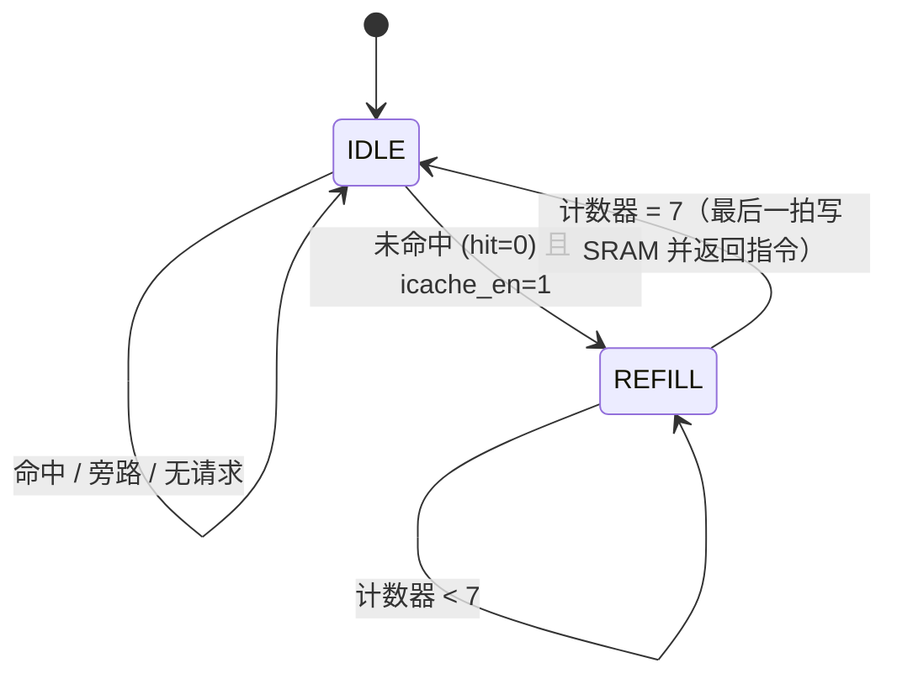

# I-cache技术规格说明

**I-Cache 技术规格说明**  
**版本**：v0.1  
**日期**：2026-04-30  

---

## 1. 模块定位

I-Cache 模块位于 CPU 与系统 RAM 之间的取指路径上，属于处理器子系统的一部分。  
模块的主要作用是在 CPU 取指令时提供低延迟命中访问，减少对 RAM 的重复读取，从而提升指令访问的平均速度。

- **上游**：CPU 指令接口（`inst_ce_o`、`inst_addr_o`、`inst_data_i`、`inst_stallreq_i`）
- **下游**：双口 RAM 的指令端口（`i_ce`、`i_addr`、`i_rdata`）
- **当前版本必须实现**，并作为功能可开关的模块参与系统仿真验证
- **不存在后续扩展功能**

---

## 2. 功能范围

### 2.1 当前版本实现

- CPU 指令读取缓存
- 直接映射，512B（16行×8字）
- 只读指令，不处理 CPU 写请求
- 整行 refill（8 字全部读回后释放 stall）
- 可硬件控制的使能 / 旁路（`icache_en`）
- 原生 CPU 接口 + 原生 RAM 接口（无 AXI）

### 2.2 当前版本不实现

- 写操作
- 缓存维护操作（flush / invalidate）
- 乱序访问、非对齐访问
- MMU / MPU 参与
- 对 flash 等慢速存储的支持

### 2.3 后续扩展方向

- 缓存维护接口
- 支持 flash / 慢速内存的 refill 机制
- 可配置替换策略

---

## 3. 接口定义

### 3.1 时钟与复位

| 信号名 | 方向 | 位宽 | 描述 |
| :--- | :--- | :--- | :--- |
| `clk` | input | 1 | 全局时钟 |
| `rst_n` | input | 1 | 低有效复位 |

### 3.2 CPU 侧接口

| 信号名               | 方向     | 位宽  | 描述                  |
| :---------------- | :----- | :-- | :------------------ |
| `inst_ce_o`       | output | 1   | CPU 取指有效            |
| `inst_addr_o`     | output | 32  | CPU 取指地址            |
| `inst_data_i`     | input  | 32  | 返回的指令数据             |
| `inst_stallreq_i` | input  | 1   | RAM 侧发给 CPU 的 stall |

### 3.3 RAM 侧接口

| 信号名 | 方向 | 位宽 | 描述 |
| :--- | :--- | :--- | :--- |
| `i_ce` | output | 1 | RAM 指令端口使能 |
| `i_addr` | output | 32 | RAM 指令端口地址 |
| `i_rdata` | input | 32 | RAM 读数据返回 |

### 3.4 控制接口

| 信号名 | 方向 | 位宽 | 描述 |
| :--- | :--- | :--- | :--- |
| `icache_en` | input | 1 | 高电平使能 Cache，低电平旁路 |

---

## 4. 寄存器定义

当前版本不实现 MMIO / CSR 寄存器。  
`icache_en` 为顶层仿真控制信号，不经过总线，不属于外设寄存器。

---

## 5. 内部架构简述

### 5.1 子模块划分

| 子模块        | 作用                                         |
| :--------- | :----------------------------------------- |
| Tag 存储器    | 存储每行的 Tag 和 Valid 位                        |
| Data 存储器   | 存储每行的 8 个 32 位指令字                          |
| 比较与命中逻辑    | 根据 Index 读出 Tag，与 CPU 地址的 Tag 比较，产生 hit 信号 |
| Refill 状态机 | 控制 Miss 时的整行填充流程                           |
| 输出选择       | 根据 Word Offset 从 8 个数据字中选出对应指令             |

### 5.2 数据通路说明

1. CPU 地址经 Index 选中一行，读出 Tag + Valid + Data。
2. 若 Valid 且 Tag 匹配，命中；根据 Word Offset 选字输出。
3. 若 Miss，则进入 Refill，从 RAM 读取 8 个连续字填入该行，更新 Tag 和 Valid，再返回命中数据。
4. 若 `icache_en = 0`，旁路：CPU 请求直达 RAM，不查 Tag，不填 Cache。

### 5.3 控制通路说明

- `icache_en = 0` 时，命中逻辑完全停用，所有请求直通 RAM。
- `icache_en = 1` 时，Refill 状态机控制 RAM 读访问、Tag/Data 写入、stall 控制。
### 5.4 控制通路说明

| 字段          | 位宽  | 地址位 `[31:0]` | 作用                  |
| :---------- | :-- | :----------- | :------------------ |
| Tag         | 23  | `[31:9]`     | 标识该行数据来自内存哪个 32 字节块 |
| Index       | 4   | `[8:5]`      | 选择 16 行中的某一行        |
| Word Offset | 3   | `[4:2]`      | 选择一行中 8 个字的哪一个      |
| Byte Offset | 2   | `[1:0]`      | 字内字节偏移，取指忽略（固定 00）  |

---

## 6. 工作流程

### 6.1 基本流程

- 复位后或 `icache_en = 0` 时，CPU 请求直接转发 RAM。
- `icache_en = 1` 时，进入缓存模式：  
  命中 → 返回数据；Miss → Refill → 填充后返回。

### 6.2 典型读流程

**命中**：

1. CPU 发出 `inst_addr`，`inst_ce_o` 拉高。
2. Cache 在同一周期完成 Tag 比较。
3. 命中：`inst_stallreq_i` 不拉高，数据在下一周期经 `inst_data_i` 返回。

**Miss**：

1. CPU 发出 `inst_addr`。
2. Cache 判断 Miss，拉高 `inst_stallreq_i`。
3. Refill 状态机从 `{tag, index, 5'b0}` 开始连续 8 次读 RAM，每次 `i_ce` = 1。
4. 8 次读完成后，写 Tag、Data、置 Valid。
5. 释放 `inst_stallreq_i`，返回命中数据。
6. CPU 继续执行。

### 6.3 错误处理流程

当前无 AXI，不涉及 `SLVERR` / `DECERR`。  
若 `icache_en=0` 时，CPU 请求直接访问 RAM；RAM 侧的行为由 RAM 自身决定。

---

## 7. 关键状态机设计

### 7.1 状态说明

| 状态 | 含义 |
| :--- | :--- |
| `IDLE` | 空闲状态。命中时组合逻辑直接返回指令，CPU 无停顿。 |
| `REFILL` | 未命中，从 RAM 连续 8 拍读取整行数据，填充 Cache SRAM。 |

**注**：当前模块错误场景极简（仅旁路模式），不设独立的错误状态。若旁路模式下 RAM 返回异常，由 RAM 侧自行处理。

---

### 7.2 状态跳转条件

| 当前状态 | 下一状态 | 跳转条件 |
| :--- | :--- | :--- |
| `IDLE` | `REFILL` | `icache_en = 1` 且 `hit = 0`（未命中） |
| `REFILL` | `IDLE` | 计数器到 7（第 8 拍写 SRAM 完成） |
| `IDLE` | `IDLE` | 其他情况：命中 / 旁路 / 无请求 |

---

### 7.3 状态转移图

---

## 8. 时序说明

### 8.1 关键握手时序

- CPU 在 `inst_ce_o` 拉高的同一周期给出 `inst_addr_o`。
- 命中时，数据在下一拍 `inst_data_i` 有效，不产生 stall。
- 未命中时，`inst_stallreq_i` 拉高，持续到 Refill 结束。

### 8.2 等待与反压

- Refill 期间，CPU 被 stall，不处理新请求。
- 旁路模式下，RAM 侧 stall 直接送给 CPU。

### 8.3 响应返回规则

- 命中：下一个时钟周期返回指令。
- 未命中：等 8 拍 RAM 读取结束后，下一拍返回指令。

### 8.4 异常时序

当前不涉及异常时序。

---

## 9. 设计决策记录

| 编号      | 决策                       | 原因                            | 影响                  |
| :------ | :----------------------- | :---------------------------- | :------------------ |
| DDR-001 | 采用 512B 直接映射             | 容量适中，硬件简单，适合裸机程序              | 行数少，Tag 较宽，可能有一定冲突率 |
| DDR-002 | 整行填充后再返回                 | 状态机最简，不易出错                    | CPU 等待 8 拍，性能微降     |
| DDR-003 | 无 AXI，纯原生接口              | 与当前 CPU / RAM 接口一致，避免 AXI 复杂度 | 后续若接入 AXI 需单独桥接     |
| DDR-004 | 使能控制由顶层 `icache_en` 引脚提供 | 简化 Cache 内部设计，方便前后仿真对比        | 需要顶层配合              |

---

## 10. 验证点清单

### 10.1 基本功能测试

- `icache_en=0` 时 CPU 取指正常
- `icache_en=1` 时，首次 Miss 后 Refill 正常
- 下一轮访问同一行地址，命中返回

### 10.2 边界条件测试

- 地址跨 Index 边界时的命中/未命中判断
- Tag 比较正确性（不同高位地址不应命中）
- 复位后 Valid 清空，取指正常 Miss 填充

### 10.3 异常场景测试

- 连续 Miss 的稳定性
- 快速切换 `icache_en` 时的行为

### 10.4 系统级联调测试

- 跑裸机程序，对比 `icache_en=0` 和 `icache_en=1` 的取指停顿情况
- 通过 stall 计数验证 Cache 带来的性能改善

---

## 11. 遗留问题

ram加入延时后，其实际运行周期数等等并未明显减少
（ 
1. 可能是ram的延时行为不对
2. 其测试指标不应该为周期数？
3. 等等的
）

---

## 12. 当前限制与后续扩展

### 12.1 当前限制

- 无 AXI 接口，无法直接挂载到标准总线
- 无缓存维护操作
- 不支持 flash 等慢速存储 refill

### 12.2 后续扩展

- 增加 AXI Master 接口
- 增加缓存维护控制信号
- 增加可配置替换策略

### 12.3 不属于当前版本范围的内容

- 写操作、写回、写写合并
- MMU / MPU 属性判断
- 多级 Cache、多核一致性

---

## 13. 变更记录

| 日期 | 版本 | 修改内容 | 说明 |
| :--- | :--- | :--- | :--- |
| 2026-04-30 | v0.1 | 创建文档 | 初始版本 |
