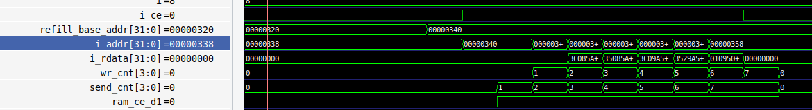
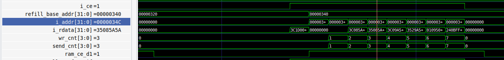

---

# Bug BUG-002：I-Cache Refill 时序内部错误导致 selftest 失败


---

## 1. 现象描述
在 SoC 集成 I-Cache 并使能（`icache_en=1`）后，运行 `selftest` 程序出现部分测试用例失败，主要表现为 `logic005` 等算术逻辑指令测试报错（错误码 `0xDEAD1005`）。将 `icache_en` 置 0（旁路模式）后，所有测试通过。

## 2. 复现步骤
1. 在 SoC 顶层集成 I-Cache，配置 `icache_en=1`。
2. 加载并运行 `selftest` 程序。
3. 观察仿真日志，出现 `0xDEAD1005` 等错误码。
4. 将 `icache_en` 改为 0，重新运行，所有测试通过。
 
错误波形

## 3. 根因分析
**位置**：`icache_top.v` 中 RAM 接口控制 和 发送/写入计数器（`send_cnt` / `wr_cnt`）时序。

**直接原因**：
Cache 在 Refill 期间无法完整填充 8 个指令字（最后填充的字保持复位后的默认值 0），导致命中时部分数据为 `0x00000000`，CPU 执行了错误指令。

**具体机制**：
1. **RAM 读使能滞后一拍**：原设计在 Cache 模式下使用寄存器 `ram_ce_reg` 驱动 `ram_inst_ce`。当发生 Miss 时，`state` 尚为 `IDLE`，组合逻辑仅更新了 `ram_ce_req_cache` 寄存器，但 `ram_ce_reg` 并未立刻更新，导致**第一个读请求延迟一拍才发出**。
2. **`send_cnt` 计数遗漏**：`send_cnt` 的递增条件仅限 `state == REFILL` 且 `ram_ce_reg` 有效。由于第一个请求发出延迟，导致实际发出的总请求数只有 **7 次**，`send_cnt` 最终未到 8。这使得 Refill 过程遗漏了最后一个字的读取和写入，对应位置的数据保持为 0。
3. **组合效应**：由于直接映射机制，如果 `logic005` 测试的关键指令恰好在 Cache 行的最后一字位置，命中时就会取到错误的 `0x00000000`，导致运算出错并触发 `0xDEAD1005`。

## 4. 修复方案
移除 Cache 模式下 RAM 接口的寄存器，改为**组合逻辑直接输出**，消除第一个读请求的延迟；同时优化 `send_cnt` 递增逻辑，确保准确发出 8 次读请求。

**核心改动点**：
```verilog
// 1. 去掉 ram_ce_reg 和 ram_addr_reg
// 2. 改为组合逻辑直驱 RAM：
wire miss_addr = {req_tag, req_index, {OFFSET_BITS+2{1'b0}}};
assign ram_inst_ce = (!icache_en) ? cpu_inst_ce :
                     (miss_req || (state == REFILL && send_cnt < 4'd8)) ? 1'b1 : 1'b0;
assign ram_inst_addr = (!icache_en) ? cpu_inst_addr :
                       miss_req ? miss_addr :
                       (state == REFILL) ? (refill_base_addr + { {27{1'b0}}, send_cnt, 2'b00 }) : 32'h0;

// 3. 优化 send_cnt 递增（REFILL 内且 ce 有效）
if (ram_inst_ce && state == REFILL && send_cnt < 4'd8)
    send_cnt <= send_cnt + 1'b1;

// 4. 退出条件使用 wr_cnt == 4'd7，确保 8 字全部写入
REFILL: if (wr_cnt == 4'd7 && ram_ce_d1) next_state = IDLE;
```

正确波形
## 5. 验证结果
- [ ] SoC 级 `selftest`：全部子用例通过，乘除法及定时器中断连续响应正常。
- [ ] 波形确认每次 Refill 均发出 8 次读请求，SRAM 写入数据与期望一致。

---

## 沉淀为设计规范
- **组合逻辑优先原则**：对于需要零延迟响应的总线接口（如 AXI 的 valid 或 SRAM 的使能），应优先使用组合逻辑驱动，避免寄存器打拍造成“第一拍空缺”的时序 Bug。
- **计数器覆盖检查**：在状态机设计时，必须梳理清楚所有触发场景（如 `IDLE` 转入 `REFILL` 的第一拍），确保计数器正确计数，不漏掉第一个或最后一次操作。
